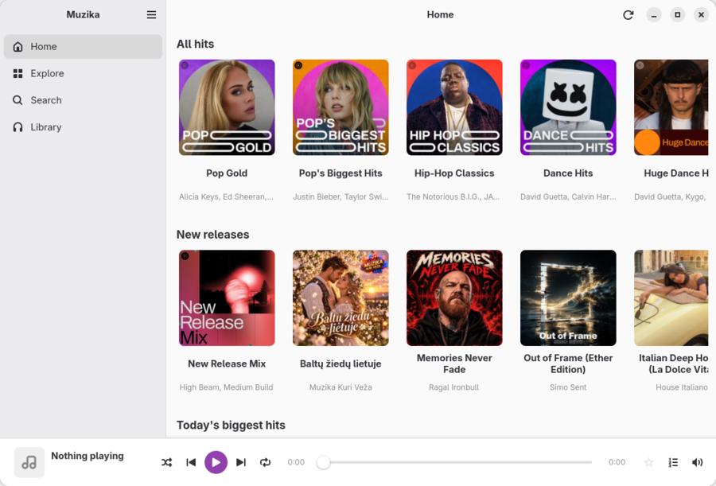
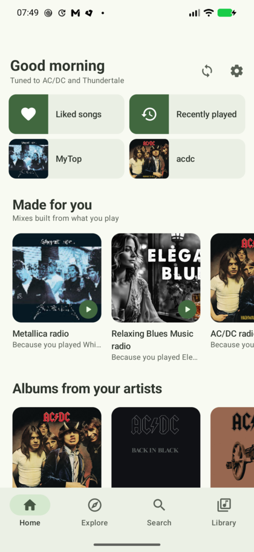
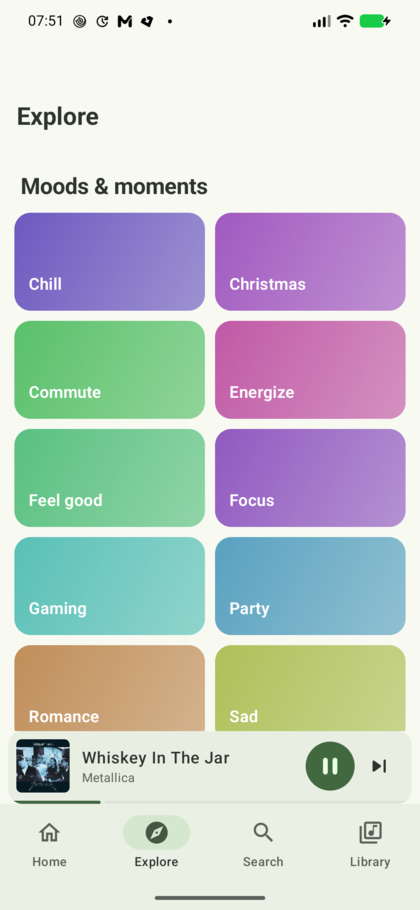
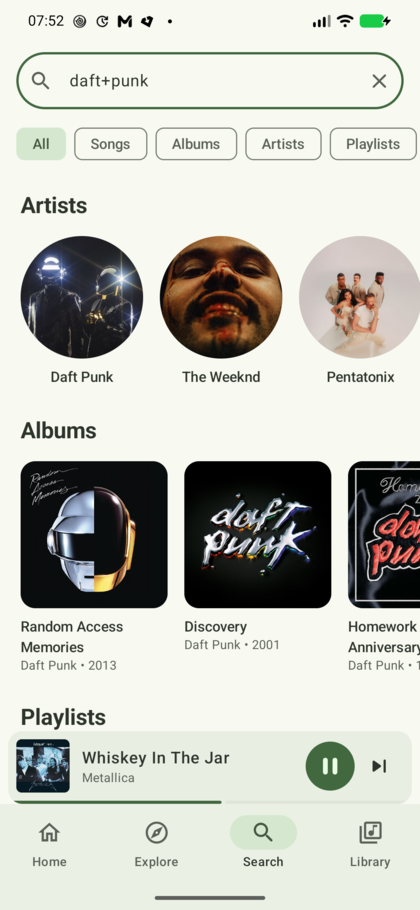
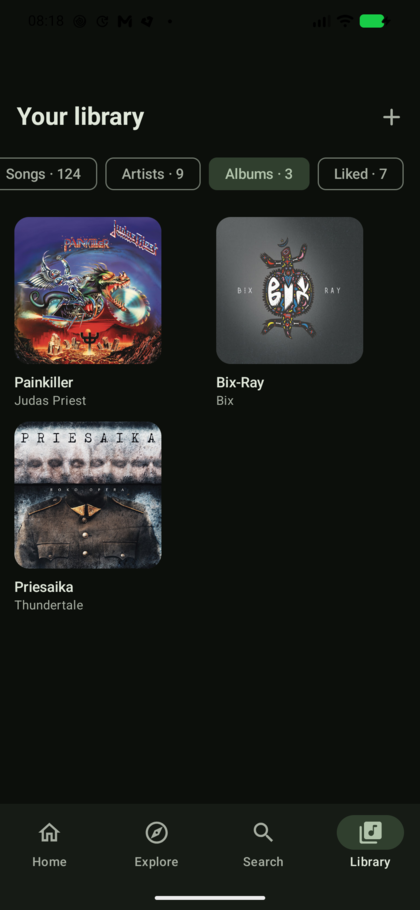
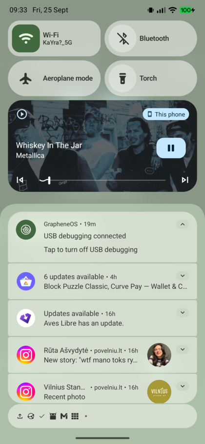

<h1 align="center">Muzika</h1>

<p align="center">
  <b>A music player for Linux and Android that needs no account.</b><br>
  YouTube Music, SoundCloud, Bandcamp and your own files — with your library
  synced between every device you own.
</p>

<p align="center">
  <a href="../../releases/latest"></a>
  <a href="LICENSE"></a>
  
  
</p>

<p align="center">
  
  
</p>

---

## What Muzika is

Two players — one for the **Linux desktop**, one for **Android** — that share a
single library file. Search once, save once, and the playlist you built on your
laptop is on your phone the next time you open it.

There is **no sign-in, no API key and no Muzika server**. YouTube Music's
catalogue endpoints answer anonymously, so browsing, searching and radios work
without an account; audio is resolved by the same extractors NewPipe and yt-dlp
use. The home page's suggestions are computed **on your own device** from your
own play history — nothing about what you listen to is uploaded anywhere.

### Sources

| Source | Search | Albums / artists | Streams |
|---|---|---|---|
| **YouTube Music** | yes | yes | yes |
| **SoundCloud** | yes | — | yes |
| **Bandcamp** | yes | — | yes |
| **Your own files** | yes | from tags | local |

Local files work for mp3, flac, m4a, aac, ogg, opus, wav, wma and more, read
with their real tags, track numbers and cover art — and an untagged file falls
back sensibly to its folder structure.

### Features

- **Search** songs, albums, artists and playlists, with filters.
- **Explore** — 36 of YouTube Music's moods and genres, each a shelf of curated
  playlists.
- **Made for you** — your most-played artists seed radios, and the home page is
  built from them.
- **Your library** — playlists you build, liked songs, saved albums and artists,
  listening history, and everything on disk.
- **Lyrics**, time-synced and following the song, from LRCLIB, NetEase and
  KuGou when YouTube Music has none.
- **Queue** with shuffle and repeat, reorderable playlists.
- **Light / dark / system** theming, wallpaper colours on Android.
- **System integration** — MPRIS on the desktop; media notification, lock-screen
  controls, a home-screen widget and launcher shortcuts on Android.

<p align="center">
  
  
  
  
</p>

---

## Install

### Android

**Obtainium (recommended — you get updates)**

1. Install [Obtainium](https://github.com/ImranR98/Obtainium).
2. *Add App* → paste `https://github.com/tpsvca/muzika` → *Add*.

It tracks every new release and updates in place.

**Or install the APK directly**

Download `muzika-x.y.z.apk` from the [latest release](../../releases/latest)
and open it. Android 8.0 (API 26) or newer.

> On first launch Muzika asks for all-files access. It is used for one thing:
> the sync folder holding `muzika-library.json` and, if you want it, your music.
> Nothing else is read.

### Linux

GTK4, libadwaita and GStreamer come from your distribution; the rest is a
normal Python install.

**Muzika needs libadwaita 1.7 or newer.** That means **Fedora 42+**,
**Debian 13 (trixie)+**, **Ubuntu 25.04+**, or a rolling release such as Arch.
Older releases — Debian 12, Ubuntu 22.04 and 24.04 LTS, Fedora 41 — ship
libadwaita 1.5 or earlier and the app will not start on them. `install.sh`
checks this and says so rather than letting you find out later.

<details open>
<summary><b>Fedora</b></summary>

```bash
sudo dnf install python3-gobject gtk4 libadwaita gstreamer1 gstreamer1-plugins-base gstreamer1-plugins-good gstreamer1-plugins-bad-free
```
</details>

<details>
<summary><b>Debian / Ubuntu</b></summary>

```bash
sudo apt update && sudo apt install python3-gi python3-gi-cairo python3-venv gir1.2-gtk-4.0 gir1.2-adw-1 gir1.2-gstreamer-1.0 gir1.2-gst-plugins-base-1.0 gstreamer1.0-plugins-good gstreamer1.0-plugins-bad
```
</details>

<details>
<summary><b>Arch</b></summary>

```bash
sudo pacman -Syu python-gobject gtk4 libadwaita gstreamer gst-plugins-base gst-plugins-good gst-plugins-bad
```
</details>

<details>
<summary><b>openSUSE</b></summary>

```bash
sudo zypper install python3-gobject python3-gobject-Gdk typelib-1_0-Gtk-4_0 typelib-1_0-Adw-1 typelib-1_0-Gst-1_0 typelib-1_0-GstPbutils-1_0 gstreamer-plugins-good gstreamer-plugins-bad
```
</details>

> Debian and Ubuntu split things other distributions ship together, and
> nothing else pulls the pieces in:
>
> - `gir1.2-gstreamer-1.0` / `gir1.2-gst-plugins-base-1.0` are GStreamer's
>   GObject **bindings** — the plugin packages alone are not enough and the app
>   cannot start without them.
> - `python3-venv` is what lets `python3 -m venv` build an environment. Without
>   it `install.sh` cannot create the virtualenv.
>
> `apt update` is part of the command on purpose. A package index that predates
> the mirror's current version makes apt ask for a `.deb` that has already been
> removed from the pool, and it fails with a bare `404 Not Found`.

Then:

```bash
git clone https://github.com/tpsvca/muzika.git
cd muzika/desktop
./install.sh
```

That creates a virtualenv under `~/.local/share/muzika/venv`, links the
`muzika` command into `~/.local/bin`, and adds the menu entry and icon.
Nothing is installed system-wide and no system Python package is touched —
which is also why it works on Debian and Ubuntu, where `pip install --user`
is refused outright ([PEP 668](https://peps.python.org/pep-0668/)).

Run it from the applications menu, or `muzika`. To run from the checkout
without installing anything: `./bin/muzika`. To remove it: `./uninstall.sh`
(your playlists and settings are kept).

### Updating

Pull and re-run the installer. It reuses the same virtualenv, so this is also
how you move between versions:

```bash
cd muzika && git pull && cd desktop && ./install.sh
```

Your playlists, settings and listening history live in
`~/.local/share/muzika/` and are untouched by an update.

Separately, extraction only keeps working because `yt-dlp` and `ytmusicapi`
keep up with the services. Those move faster than Muzika does, so update them
whenever a search or a track stops working:

```bash
~/.local/share/muzika/venv/bin/pip install --upgrade yt-dlp ytmusicapi
```

### If apt cannot find a package

A `404 Not Found` on a `.deb` while apt insists everything is up to date means
the local package index is naming a version the mirror has already replaced —
Debian's point releases supersede files and remove the old ones. `apt update`
alone will not fix it, because apt believes its index is current. Throw the
index away and fetch it again:

```bash
sudo rm -rf /var/lib/apt/lists/* && sudo apt update
```

### If it will not start

Ask the app what is missing — it names the packages for your distribution:

```bash
~/.local/share/muzika/venv/bin/python -m muzika.preflight
```

---

## Syncing between devices

Both apps read and write **one file**, `muzika-library.json`, in a folder of
your choosing. Point every device at a folder your sync service already
carries and they meet — there is no account and no server in the middle.

Works with **Syncthing**, **Dropbox**, **Nextcloud**, **OpenCloud**, or
anything else that syncs a folder. Set it in **Settings → Sync** on each
device; Android defaults to `/storage/emulated/0/Muzika`. Dropbox can also be
driven directly over its API with a token you generate yourself.

To carry the audio as well, add a music folder in **Settings → Music** on the
desktop and press *Copy music into the sync folder*. Your originals are never
moved. The format is documented in [`docs/sync-format.md`](docs/sync-format.md).

---

## Building

### Android

```bash
cd android
./gradlew assembleDebug        # app/build/outputs/apk/debug/
./gradlew testDebugUnitTest    # live tests against the real API
```

JDK 17 and an Android SDK. Point at the SDK with `local.properties`
(`sdk.dir=/path/to/Android/Sdk`) or `ANDROID_HOME`.

### Desktop

```bash
cd desktop && pip install --user -e .
```

---

## How it works

YouTube Music's `browse`, `search` and `next` endpoints answer **anonymously**;
only its `player` endpoint demands a login. That single fact is why this works
without an account: the catalogue — search, albums, artists, moods, radios —
comes straight from InnerTube, while the audio stream is resolved by
[NewPipeExtractor](https://github.com/TeamNewPipe/NewPipeExtractor) on Android
and [yt-dlp](https://github.com/yt-dlp/yt-dlp) on the desktop.

| | Desktop | Android |
|---|---|---|
| UI | GTK4 + libadwaita | Jetpack Compose, Material 3 |
| Language | Python | Kotlin |
| Playback | GStreamer `playbin3` | Media3 ExoPlayer |
| Extraction | yt-dlp, ytmusicapi | NewPipeExtractor, InnerTube |
| Storage | SQLite | SQLite |

---

## Credits

Muzika stands on work other people did first:

- **[AudioTube](https://invent.kde.org/multimedia/audiotube)** (KDE) — the
  desktop player began as a GNOME-native answer to AudioTube, and its approach
  of pairing `ytmusicapi` with `yt-dlp` is the one Muzika still uses. If you are
  on KDE, use AudioTube; it is a fine player and better integrated there than
  this will ever be.
- **[NewPipeExtractor](https://github.com/TeamNewPipe/NewPipeExtractor)** (Team NewPipe)
- **[yt-dlp](https://github.com/yt-dlp/yt-dlp)** and
  **[ytmusicapi](https://github.com/sigma67/ytmusicapi)**
- **[LRCLIB](https://lrclib.net/)** for synced lyrics

---

## Support

Muzika is free and always will be. If it saved you some time or replaced
something worse, you can buy me a coffee:

<a href="https://www.paypal.com/donate/?business=jonas%40a777web.com&item_name=Muzika&currency_code=EUR&amount=5">
  
</a>

---

## Contributing

Issues and pull requests are welcome — see
[CONTRIBUTING.md](CONTRIBUTING.md). Keep changes focused, and say in the PR
what you actually verified rather than what you expect to work.

---

## Legal

Muzika is an independent project, not affiliated with, endorsed by or connected
to Google, YouTube, SoundCloud or Bandcamp in any way.

It extracts publicly reachable streams the same way NewPipe and yt-dlp do.
Doing so may conflict with those services' Terms of Service in your
jurisdiction, and you are responsible for how you use it. Nothing here
circumvents DRM, paid subscriptions or access controls, and no content is
hosted or redistributed.

## Licence

[GPL-3.0-or-later](LICENSE). The Android app links NewPipeExtractor, which is
GPL-3.0 — so the GPL here is a requirement, not a preference.
